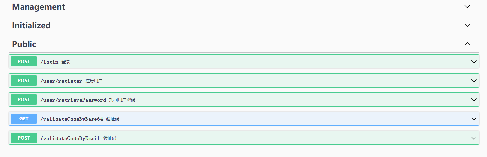
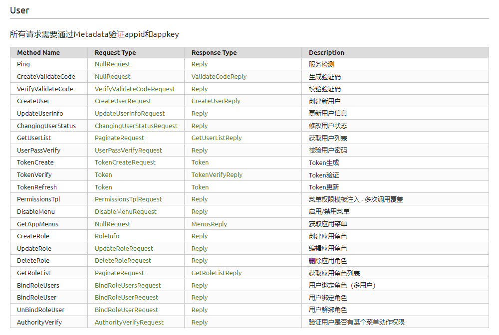
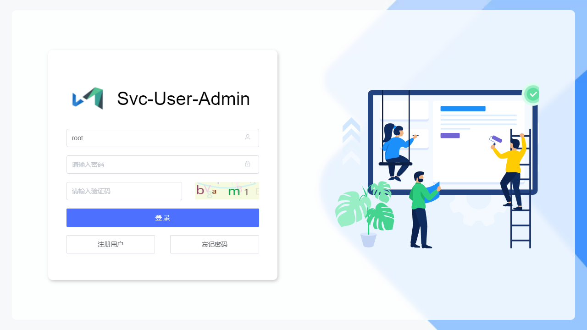
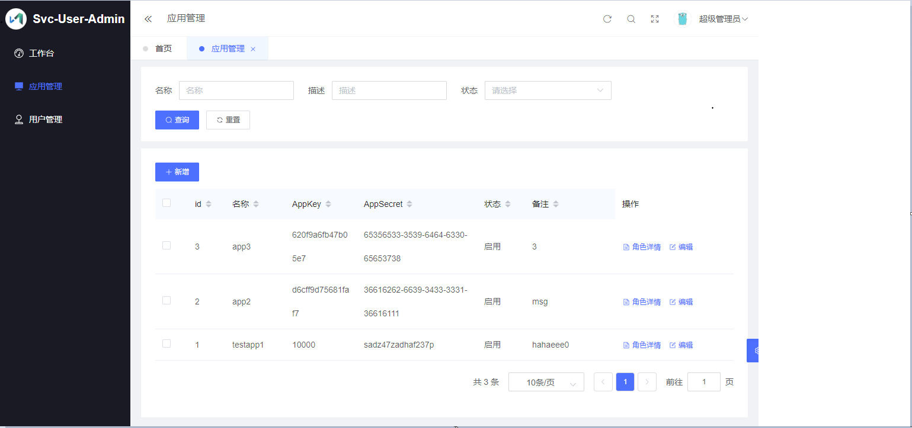

# svc-user 


> 避免每次开发cms类后台总要重复写用户管理功能代码，svc-user是Go实现的微服务用户系统，grpc+api模式，一对多，统一的用户管理，但角色、权限和菜单隔离。包含 用户、角色、登录、权限、菜单、JWT 等。
>
> 推荐开发cms后台可以直接实现业务功能，无需开发任何用户管理的页面功能，通过svc-user统一管理用户角色。如业务功能必须与用户关联，可将grpc服务封装接口给前端实现页面。

> 高可用：可部署多节点，通过nginx等负载即可

## 开发环境依赖

* 使用Go Modules
* go get -u github.com/swaggo/swag/cmd/swag
* go get -u github.com/golang/protobuf
* cd $GOPATH/pkg/mod/github.com/golang/protobuf@v1.5.2/protoc-gen-go/
* go install
* 安装protoc
* [https://github.com/protocolbuffers/protobuf/releases/](https://links.jianshu.com/go?to=https%3A%2F%2Fgithub.com%2Fprotocolbuffers%2Fprotobuf%2Freleases%2F) 下载程序并修改环境变量

## 数据表和主要字段

* users      用户基础表
    * Account  `string`
    * Password  `string`
    * Mobile  `string`
    * Email `string`
* infos       用户信息表
    * RealName  `string`
    * Age  `uint`
    * Sex  `uint`
    * Address `string`
    * IdCard `string`
* apps       应用注册表
    * Name  `string`
    * Remark  `string`
    * AppKey  `string`
    * AppSecret `string`
* menus   菜单表，权限模板
    * PID  `uint`
    * Code  `string`
    * Name  `string`
    * Uri  `string`
    * Remark `string`
    * Sequence  `uint`
    * Actions  `string`
    * AppKey `string`
* roles       应用角色表
    * Name  `string`
    * Remark  `string`
    * Sequence  `uint`
    * AppKey  `string`
* roleAuthoritys       角色权限表
    * Code  `string`
    * ActionValue `string`
    * RoleID `uint`

* roleUserMap        角色用户关系表
  * AppKey `string`
  * UserID `uint`
  * RoleID `uint`


## API  注释

> http://127.0.0.1:8888/docs/swagger/index.html
>
> http://127.0.0.1:8888/docs/proto/






## 部署

### 支持

- 部署 Mysql

### 配置文件

You should modify `/etc/svc-user.yml`

```yaml
listen: 0.0.0.0:8888
logger:
  dir: /var/log/svc-user
  level: 5
  rotate: true
  keepdays: 7
mysql:
  host: 127.0.0.1
  port: 3306
  pass: 123456
  user: root
  name: dvsdb30
redis:
  cluster: false
  addr: 
    - 127.0.0.1:6379
  pass: 123456
smtp:
  host: smtp.exmail.qq.com
  port: 25
  user: xxx@xxx.com
  pass: xxx
```

### 编译部署
```shell
// 依赖protoc和swag
// 更新grpc文档
protoc -I proto --go_out=plugins=grpc:. ./proto/user.proto --doc_out=./docs --doc_opt=html,index.html
protoc --php_out=sdk/php ./proto/user.proto
// 更新API文档
swag init --exclude proto
go build
编辑配置文件
vi /etc/svc-user.yml
启动服务
./svc-user

// rpm打包
sh build.sh 1.0.0.001
rpm包安装启动
systemctl start svc-user
```

## 使用

服务启动后访问http://127.0.0.1:8888/ 访问管理后台，默认管理用户root，密码123456，除了root，普通用户无法登录管理后台。



用户使用：

​		注册账号需要通过邀请码，管理员通过后台工作台生成，注册账号后即可登录所有接入此系统的应用。登录后的权限与菜单管理根据各应用情况区分。

应用开发：

​		登录后台后 - 应用管理 - 新增，分配appKey和appSecret；通过grpc发起服务调用。管理用户、角色、配置自己的应用菜单或权限模板，可参考examples和sdk目录下的例子。



​		应用接入开发时，以下公共接口可以直接使用。或通过RPC服务实现自己的接口。

* Public API：		

  * ValidateCode
    * /api/validateCodeByBase64			//  获取图形验证码 
    * /api/validateCodeByEmail	           //  发送验证码到执行邮箱，用于登录和注册用户
  * User
    * /api/user/register					 	     // 注册新用户
    * /api/user/retrievePassword             //  找回用户密码 
  * Login
    * /api/login										    // 通过账号、手机、或邮箱地址和密码登录 

* GRPC       // 所有服务调用需要验证appKey和appSecret

  | Method Name        | Request Type                                                 | Response Type                                                | Description                     |
  | ------------------ | ------------------------------------------------------------ | ------------------------------------------------------------ | ------------------------------- |
  | Ping               | [NullRequest](http://192.168.88.56:8888/docs/proto/#proto.NullRequest) | [Reply](http://192.168.88.56:8888/docs/proto/#proto.Reply)   | 服务检测                        |
  | CreateValidateCode | [NullRequest](http://192.168.88.56:8888/docs/proto/#proto.NullRequest) | [ValidateCodeReply](http://192.168.88.56:8888/docs/proto/#proto.ValidateCodeReply) | 生成验证码                      |
  | VerifyValidateCode | [VerifyValidateCodeRequest](http://192.168.88.56:8888/docs/proto/#proto.VerifyValidateCodeRequest) | [Reply](http://192.168.88.56:8888/docs/proto/#proto.Reply)   | 校验验证码                      |
  | CreateUser         | [CreateUserRequest](http://192.168.88.56:8888/docs/proto/#proto.CreateUserRequest) | [CreateUserReply](http://192.168.88.56:8888/docs/proto/#proto.CreateUserReply) | 创建新用户                      |
  | UpdateUserInfo     | [UpdateUserInfoRequest](http://192.168.88.56:8888/docs/proto/#proto.UpdateUserInfoRequest) | [Reply](http://192.168.88.56:8888/docs/proto/#proto.Reply)   | 更新用户信息                    |
  | ChangingUserStatus | [ChangingUserStatusRequest](http://192.168.88.56:8888/docs/proto/#proto.ChangingUserStatusRequest) | [Reply](http://192.168.88.56:8888/docs/proto/#proto.Reply)   | 修改用户状态                    |
  | GetUserList        | [PaginateRequest](http://192.168.88.56:8888/docs/proto/#proto.PaginateRequest) | [GetUserListReply](http://192.168.88.56:8888/docs/proto/#proto.GetUserListReply) | 获取用户列表                    |
  | UserPassVerify     | [UserPassVerifyRequest](http://192.168.88.56:8888/docs/proto/#proto.UserPassVerifyRequest) | [Reply](http://192.168.88.56:8888/docs/proto/#proto.Reply)   | 校验用户密码                    |
  | TokenCreate        | [TokenCreateRequest](http://192.168.88.56:8888/docs/proto/#proto.TokenCreateRequest) | [Token](http://192.168.88.56:8888/docs/proto/#proto.Token)   | Token生成                       |
  | TokenVerify        | [Token](http://192.168.88.56:8888/docs/proto/#proto.Token)   | [TokenVerifyReply](http://192.168.88.56:8888/docs/proto/#proto.TokenVerifyReply) | Token验证                       |
  | TokenRefresh       | [Token](http://192.168.88.56:8888/docs/proto/#proto.Token)   | [Token](http://192.168.88.56:8888/docs/proto/#proto.Token)   | Token更新                       |
  | PermissionsTpl     | [PermissionsTplRequest](http://192.168.88.56:8888/docs/proto/#proto.PermissionsTplRequest) | [Reply](http://192.168.88.56:8888/docs/proto/#proto.Reply)   | 菜单权限模板注入 - 多次调用覆盖 |
  | DisableMenu        | [DisableMenuRequest](http://192.168.88.56:8888/docs/proto/#proto.DisableMenuRequest) | [Reply](http://192.168.88.56:8888/docs/proto/#proto.Reply)   | 启用/禁用菜单                   |
  | GetAppMenus        | [NullRequest](http://192.168.88.56:8888/docs/proto/#proto.NullRequest) | [MenusReply](http://192.168.88.56:8888/docs/proto/#proto.MenusReply) | 获取应用菜单                    |
  | CreateRole         | [RoleInfo](http://192.168.88.56:8888/docs/proto/#proto.RoleInfo) | [Reply](http://192.168.88.56:8888/docs/proto/#proto.Reply)   | 创建应用角色                    |
  | UpdateRole         | [UpdateRoleRequest](http://192.168.88.56:8888/docs/proto/#proto.UpdateRoleRequest) | [Reply](http://192.168.88.56:8888/docs/proto/#proto.Reply)   | 编辑应用角色                    |
  | DeleteRole         | [DeleteRoleRequest](http://192.168.88.56:8888/docs/proto/#proto.DeleteRoleRequest) | [Reply](http://192.168.88.56:8888/docs/proto/#proto.Reply)   | 删除应用角色                    |
  | GetRoleList        | [PaginateRequest](http://192.168.88.56:8888/docs/proto/#proto.PaginateRequest) | [GetRoleListReply](http://192.168.88.56:8888/docs/proto/#proto.GetRoleListReply) | 获取应用角色列表                |
  | BindRoleUsers      | [BindRoleUsersRequest](http://192.168.88.56:8888/docs/proto/#proto.BindRoleUsersRequest) | [Reply](http://192.168.88.56:8888/docs/proto/#proto.Reply)   | 用户绑定角色（多用户）          |
  | BindRoleUser       | [BindRoleUserRequest](http://192.168.88.56:8888/docs/proto/#proto.BindRoleUserRequest) | [Reply](http://192.168.88.56:8888/docs/proto/#proto.Reply)   | 用户绑定角色                    |
  | UnBindRoleUser     | [BindRoleUserRequest](http://192.168.88.56:8888/docs/proto/#proto.BindRoleUserRequest) | [Reply](http://192.168.88.56:8888/docs/proto/#proto.Reply)   | 用户解绑角色                    |
  | AuthorityVerify    | [AuthorityVerifyRequest](http://192.168.88.56:8888/docs/proto/#proto.AuthorityVerifyRequest) | [Reply](http://192.168.88.56:8888/docs/proto/#proto.Reply)   | 验证用户是否有某个菜单动作权限  |


## 使用php-sdk

将sdk下php目录拷贝到你自己的项目内，引入Api.php进行调用服务。


